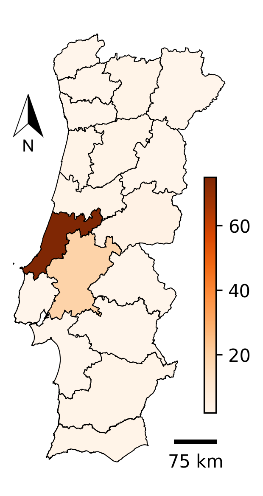
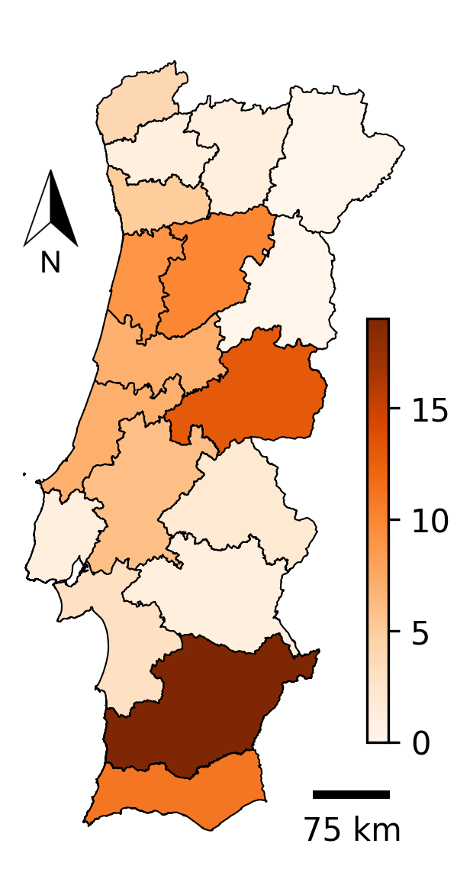
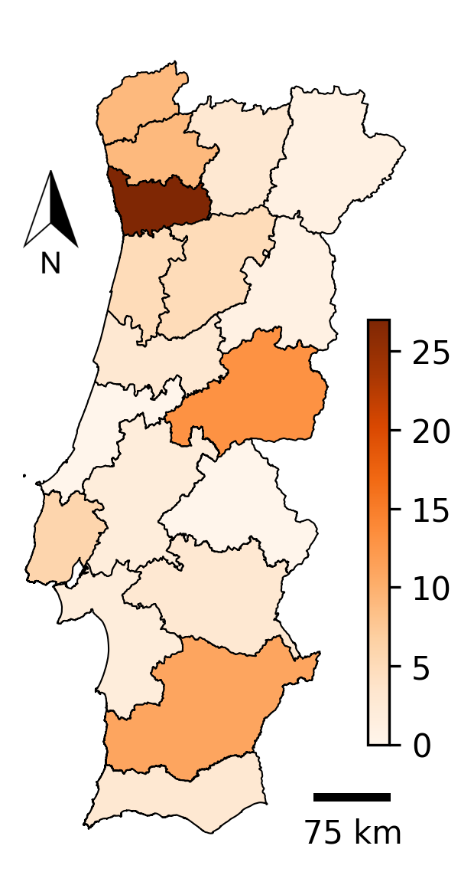

# Wildfire Heat Map Generation with Twitter and BERT

This repository contains the code and resources for generating wildfire heat maps of Portugal using Twitter data and a fine-tuned BERT language model. The project was initially developed for the Portuguese conference RECPAD 2022 conference, where it was chosen as one of the top 4 papers. It also serves as the repository for the extended version of the paper, which will be published soon. The system can easily be extended to work with other countries or languages.

## Description

The goal of this project is to extract pertinent information from social media posts during fire events and create a heat map indicating the most probable fire locations. The pipeline consists of the following steps:

1. **Data Collection:** Obtain fire-related tweets from Twitter using the SNScrape API, filtering for Portuguese language and keywords like "fogo" and "incêndio" ("fire" and "wildfire").

2. **Classification:** Use a finetuned BERT instance to classify and filter out tweets that are not fire reports.

3. **Geoparsing:** Extract fire locations from tweets through Named Entity Recognition (NER), concatenating recognized location names to form a preliminary geocode, and retrieving the corresponding region geometry using the Nominatim API.

4. **Intersection Detection:** Identify intersections between extracted fire report regions and a predefined area of interest (e.g., Portugal), calculate intersection counts, and generate a heat map to visualize regions with a higher volume of fire occurences.

The resulting heat maps can be useful in allocating firefighting resources effectively. The system is easily adaptable to work with other countries or languages as long as compatible BERT and NER models are available.

## Usage

To use this project, follow the instructions below:

1. Install the required libraries by running the following command in the root directory of the project.
   
   ```bash
   python -r requirements.txt
   ```
2. Generate a heatmap for a specific date using the following command:

   ```bash
   python src/heatmap.py <date>
   ```
   Replace `<date>` with the desired date in the format `yyyy-mm-dd`.
   
## Examples

Here are a few examples of the wildfire heat maps generated using our system. These maps correspond to the dates June 18, 2017; July 3, 2019; and August 7, 2022. The first image specifically highlights the notable fires in Pedrógão Grande, Leiria, which our method was able to identify and depict on the map.

  

## License

This project is licensed under the [MIT License](LICENSE).

## Citation

If you use this project or find it helpful for your research, please consider citing the following paper:

*João Cabral Pinto, Hugo Gonçalo Oliveira, Catarina Silva, Alberto Cardoso*, "Using Twitter Data and Natural Language Processing to Generate Wildfire Heat Maps", *28TH Portuguese Conference on Pattern Recognition (RECPAD 2022)*, *2022*.
